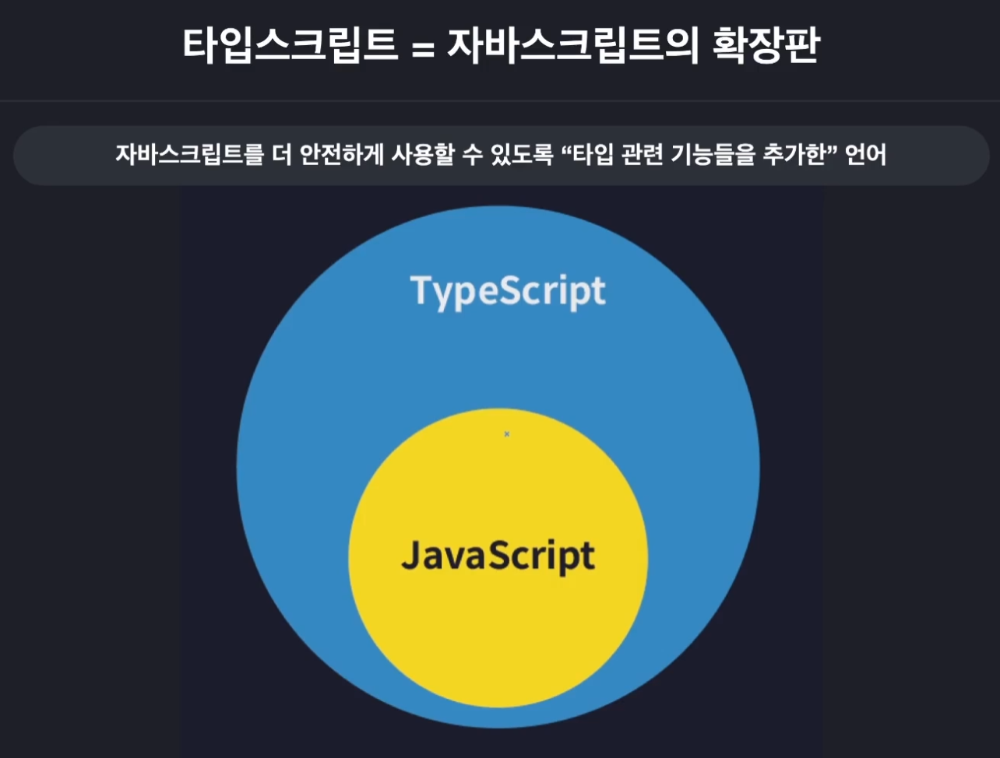
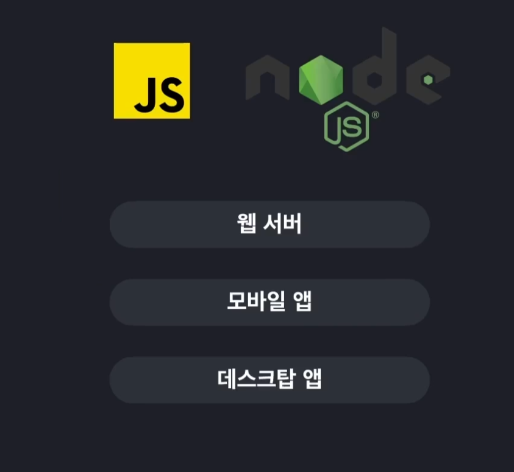
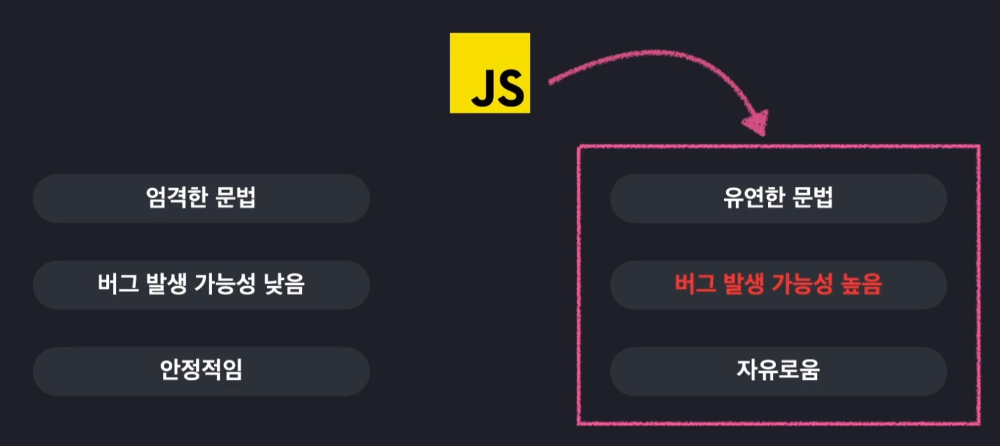
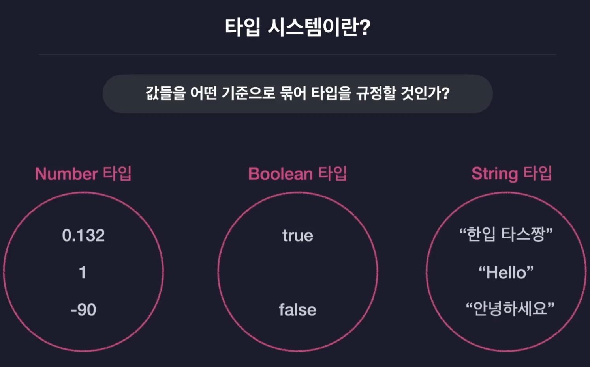
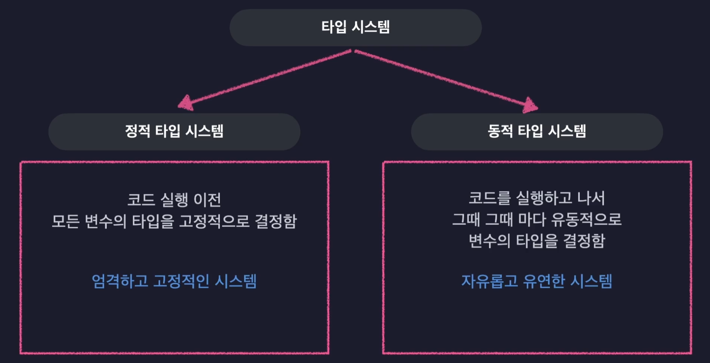
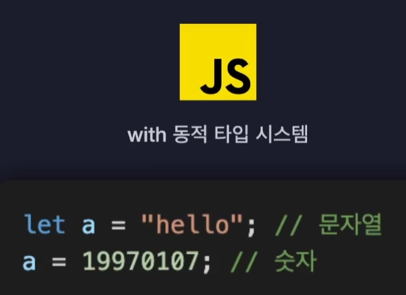
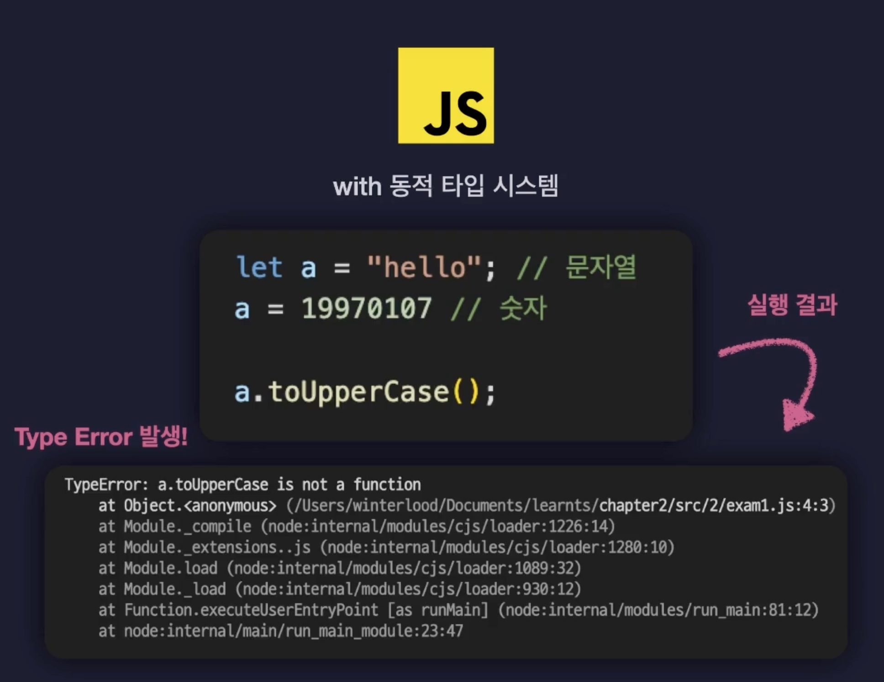
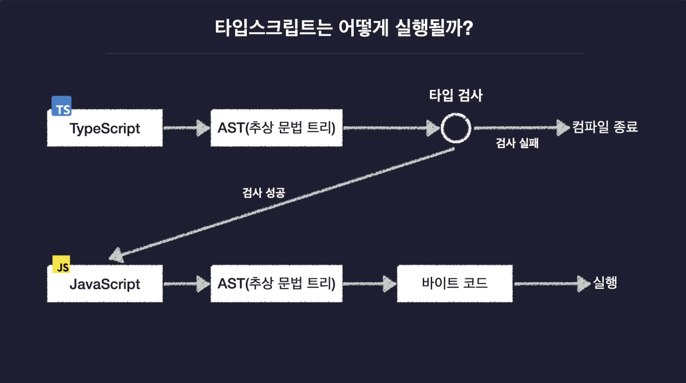
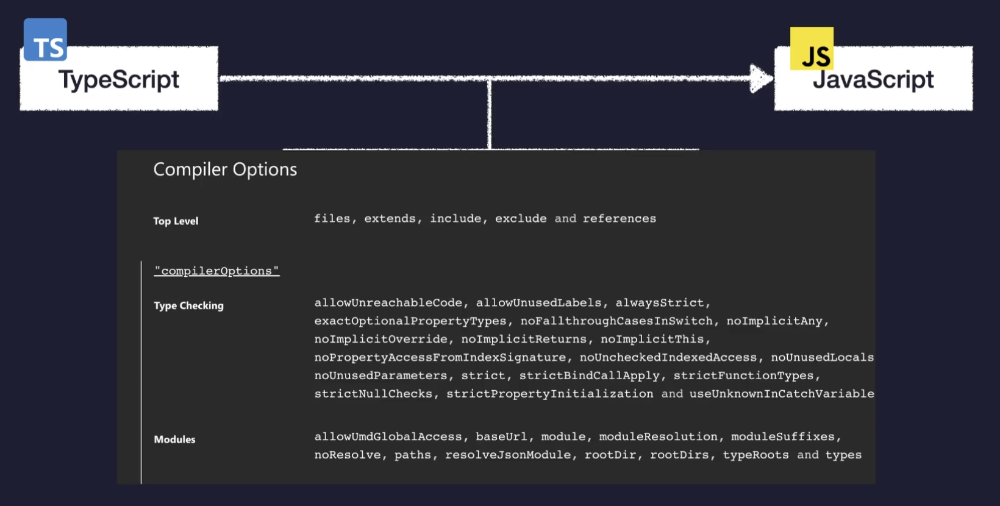

# 섹션 1. 강의 소개 및 타입스크립트 개론

## 4. 타입스크립트를 소개합니다

### 타입스크립트는 일종의 자바스크립트 확장판이라고 볼 수 있다.

- 자바스크립트를 저 안전하게 사용할 수 있도록 "타입 관련 기능들을 추가한" 언어
  

### 자바스크립트도 잘 나가는데 굳이 타입스크립트가 필요할까?

- 자바스크립트는 원래 아주 간단한 상호작용 정도를 처리하기 위해 개발되었다.
  
- node.js 가 등장하면서 web에서만 실행시킬 수 있던 자바스크립트를 어디에서도 실행시킬 수 있게 되었다.

## 5. 자바스크립트의 한계점(단점)과 타입스크립트

### 꼭 알고가야 하는 타입 시스템

- 모든 프로그래밍 언어는 타입 시스템을 가지고 있다.
  
  
- 쉽게 말하자면 타입시스템은 언어의 타입 관련된 문법 체계라고도 볼 수 있다.
  

- 자바스크립트의 동적 타입 시스템은 변수의 타입들을 코드가 실행되는 도중에 결정함
  = 변수의 타입을 우리가 직접 정의하지 않음

- 변수의 타입이 하나로만 고정되지 않음
  = 아무 타입의 값이나 자유롭게 담을 수 있음
  

- 변수에 맞지 않는 함수를 실행할 경우 아래와 같이 타입에 대한 오류가 발생한다
  
  이유는 문자열에 사용하는 함수를 숫자에 사용했기 때문이다.

## 6. 타입스크립트의 동작 원리

타입스크립트는 타입 검사를 거쳐 자바스크팁으로 다시 변환된다.  
이렇게 변화된 자바스크립트는 결국 타입안정성이 확보된 자바스크립트이다.

## 7. hello ts world!

- 타입스크립트를 전역으로 설치해줍니다.
  sudo npm i @types/node
  sudo npm install typesctipt -g

- 타입스크립트를 컴파일 하려면 tsc 파일경로/파일이름.ts
  파일이 컴파일되면 일반 자바스크립트로 바뀌며, 이때 지정했던 타입들은 자바스크립트 파일은 없다
- 컴파일된 파일을 로드하려면 node 파일경로/파일이름.js 를 입력해주면 된다.

- ts-node 를 이용하면 이를 한번에 할 수도 있다
  sudo npm i ts-node -g 이렇게 전역으로 설치해준다.
  다만 node 20 이상에서는 tsx를 사용해야한다.
  sudo npm i -g tsx 를 통해 설치하고 tsx 파일경로/파일이름.ts 를 통해 정상 작동함을 확인할 수 있다.

## 8. 7번 회차 오류 정정

## 9. 타입스크립트 컴파일러 옵션 설정하기

- 컴파일러 옵션이란?
  - 얼마나 엄격하게 타입 오류를 검사할지
  - 자바스크립트 코드의 버전은 어떻게 할지
    

<strong>tsc --init</strong> 을 사용하여 typescript의 tsconfig.json을 초기화 할 수 있다.

### 옵션 목록

<ul>
  <li>include : 컴파일할 파일의 범위를 지정해준다</li>
   
  <strong>"compilerOptions"</strong>
  <li>target : 타입스크립트를 컴파일해서 만드는 자바스크립트의 버전을 지정한다  
  이 옵션은 예전 버전의 자바스크립트만 지원하는 환경에서 구동해야할 때 유용하게 사용된다
  </li>
  <li>
    module : 모듈옵션을 설정해준다 (CommonJS 와 ESM 이 대표적인 모듈시스템)  
    프로젝트 상황에 따라 버전을 조정해주는 것이 필요하다  
    CommonJS(CJS) : const a = require(...) / module.exports 등으로 불러오고 내보내고 
    ESM : import a from '...' export default 등으로 불러오고 내보낸다
  </li>
  <li>
  outDir : 컴파일된 자바스크립트 파일들이 생성될 경로를 지정해준다
  </li>
  <li>
    strict: 타입 검사를 엄격하개 할지 느슨하게 할지 설정하는 옵션
  </li>
</ul>
