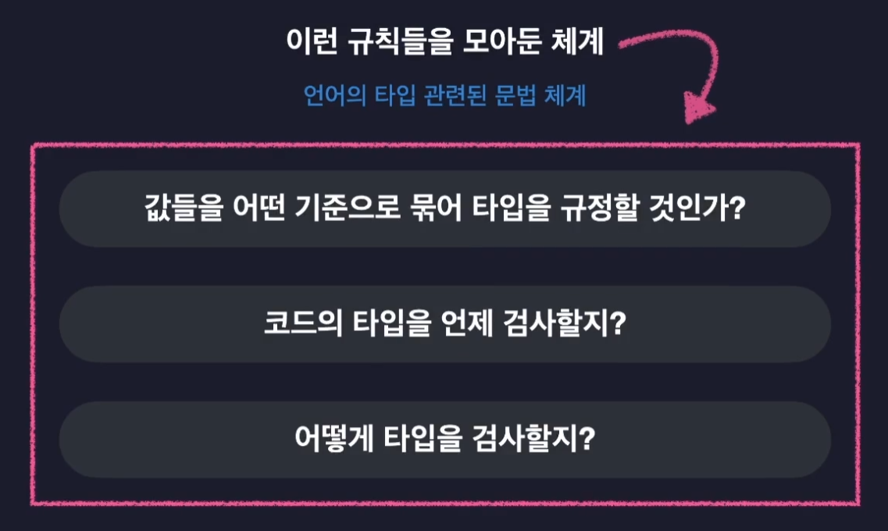

# 섹션 1. 강의 소개 및 타입스크립트 개론

## 타입스크립트를 소개합니다

### 타입스크립트는 일종의 자바스크립트 확장판이라고 볼 수 있다.
- 자바스크립트를 저 안전하게 사용할 수 있도록 "타입 관련 기능들을 추가한" 언어

### 자바스크립트도 잘 나가는데 굳이 타입스크립트가 필요할까?
- 자바스크립트는 원래 아주 간단한 상호작용 정도를 처리하기 위해 개발되었다.

- node.js 가 등장하면서 web에서만 실행시킬 수 있던 자바스크립트를 어디에서도 실행시킬 수 있게 되었다.

## 자바스크립트의 단점과 타입스크립트

### 꼭 알고가야 하는 타입 시스템
- 모든 프로그래밍 언어는 타입 시스템을 가지고 있다.

- 쉽게 말하자면 타입시스템은 언어의 타입 관련된 문법 체계라고도 볼 수 있다.

- 자바스크립트의 동적 타입 시스템은 변수의 타입들을 코드가 실행되는 도중에 결정함 
    = 변수의 타입을 우리가 직접 정의하지 않음

- 변수의 타입이 하나로만 고정되지 않음
    = 아무 타입의 값이나 자유롭게 담을 수 있음
