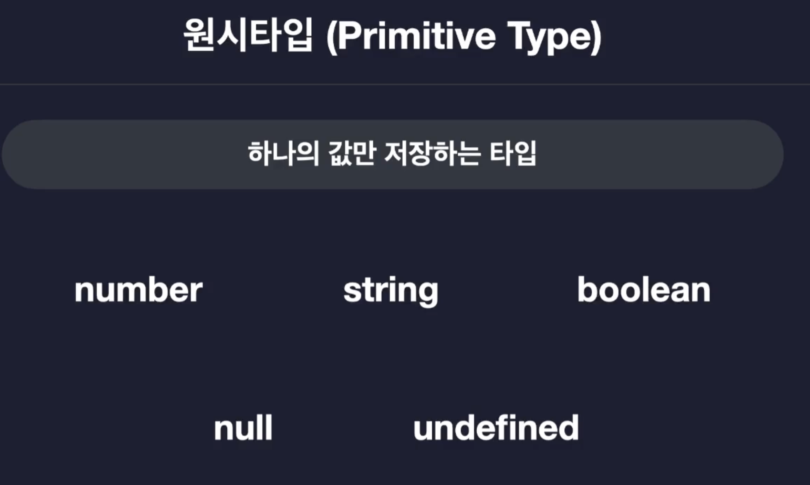
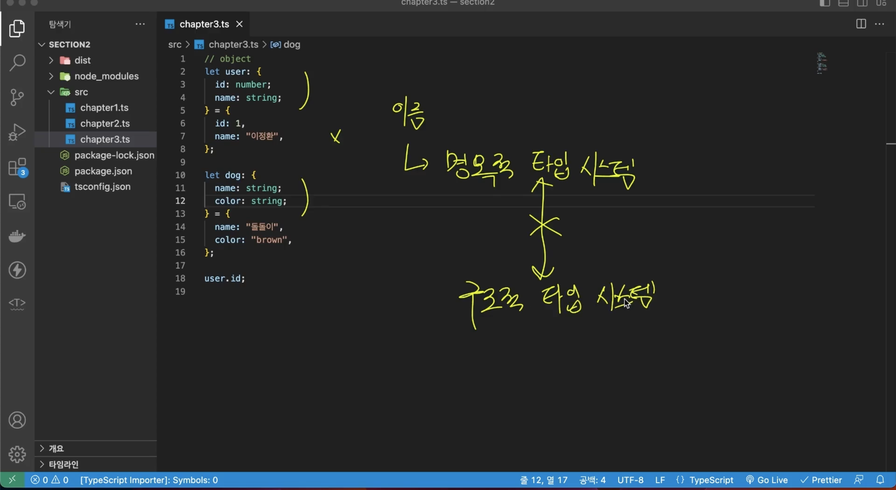
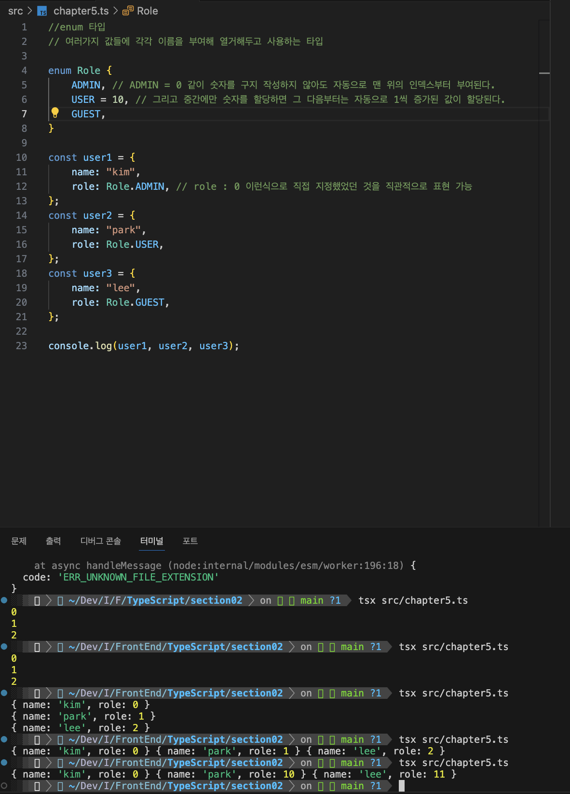

# 섹션 2. 타입스크립트 기본

## 11. 기본 타입

## 12. 원시타입과 리터럴 타입

배열이나 객체같은 비원시타입의 경우 동시에 여러 값을 저장할 수 있다.  
실습 : src/chapter1.ts

## 13. 배열과 튜플

실습 : src/chapter2.ts

## 14. 객체

실습 : src/chapter3.ts

## 15. 타입 별칭과 인덱스 시그니처

실습 : src/chapter4.ts

## 16. 열거형 타입 (Enum)

실습 : src/chapter5.ts
자바스크립트에는 없고 타입스크립트에만 있다.

enum의 종류

1. 숫자형
2. 문자형

## 17. Any 타입과 Unknown 타입

실습 : src/chapter6.ts

## 18. Void와 Never 타입

실습 : src/chapter7.ts
