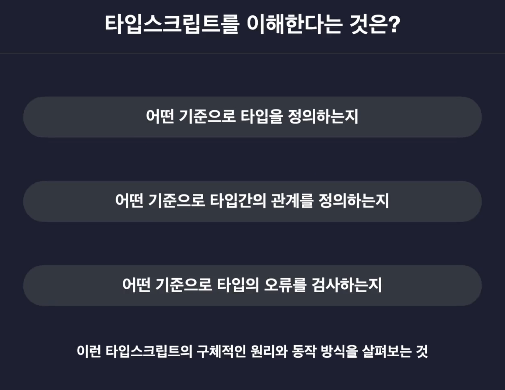
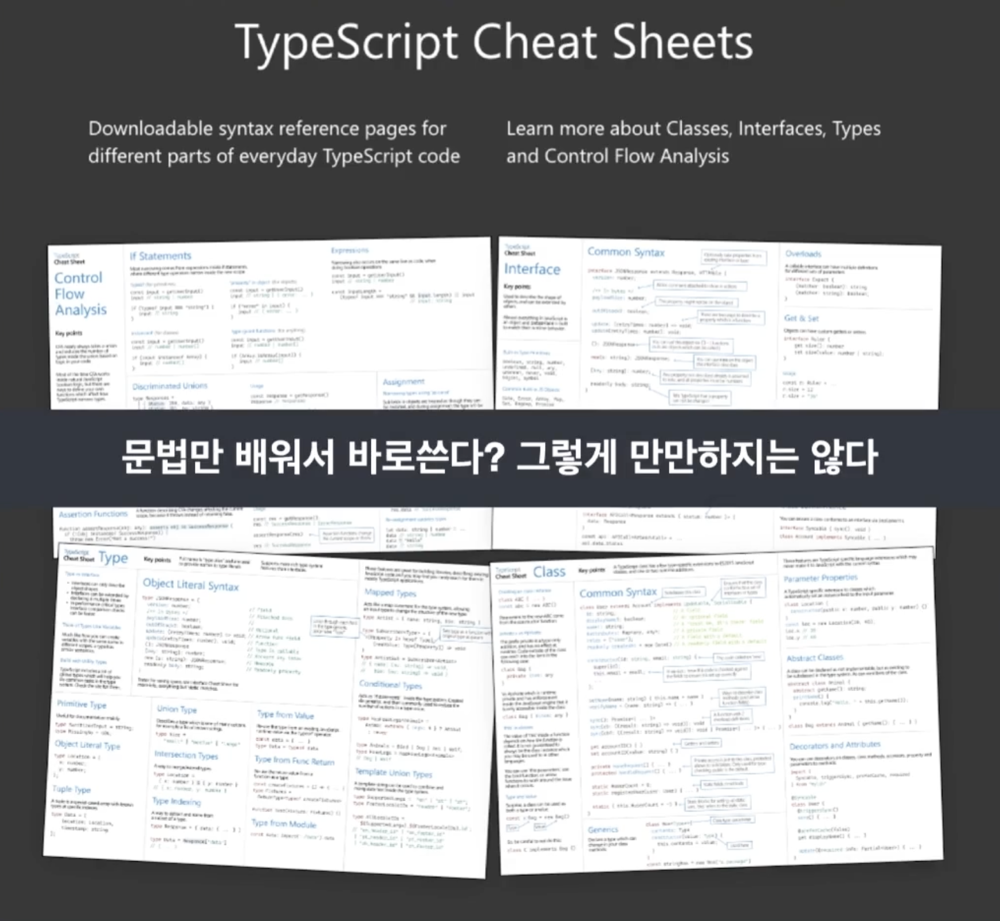
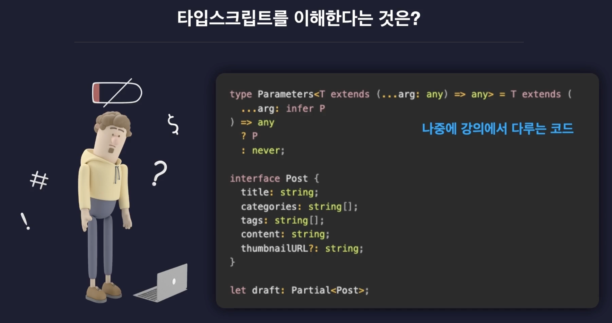
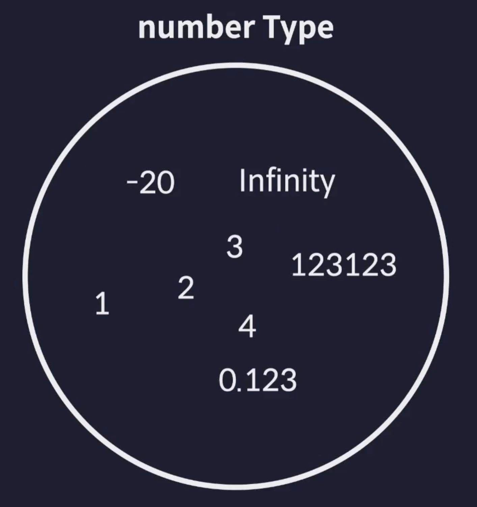
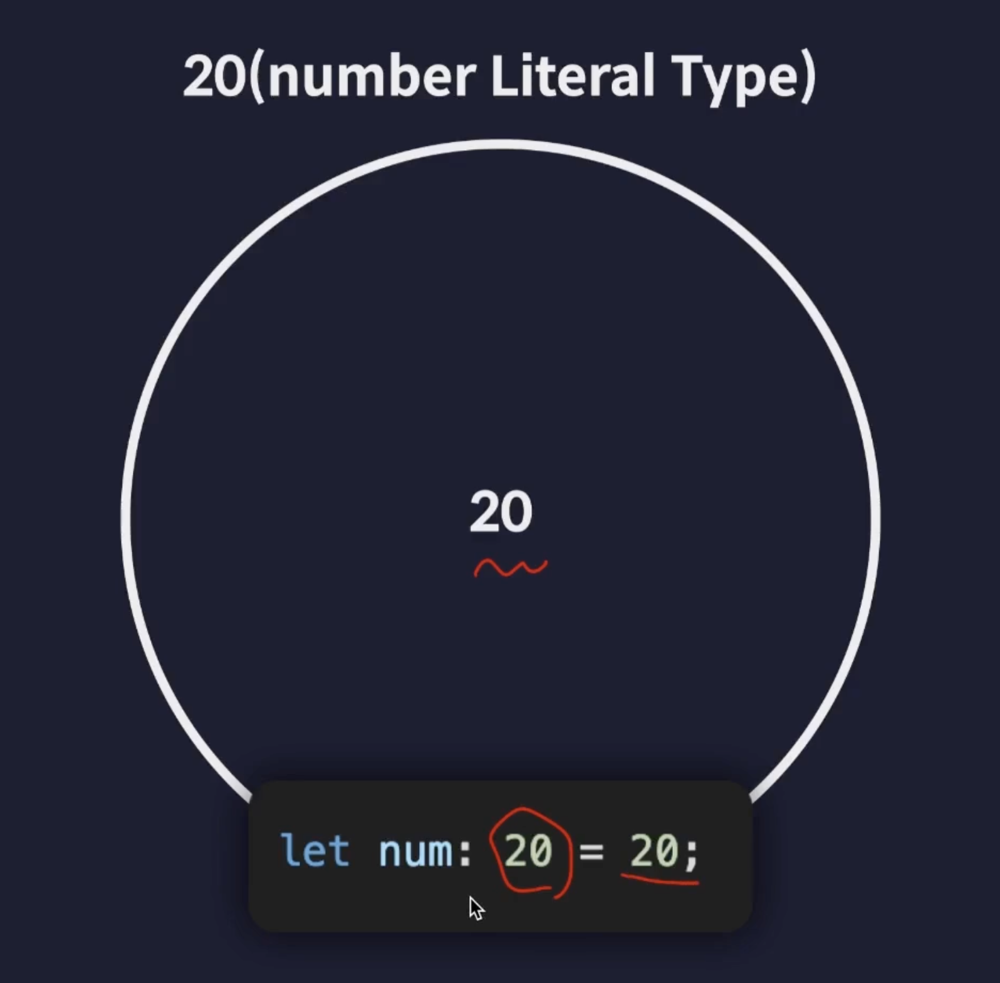
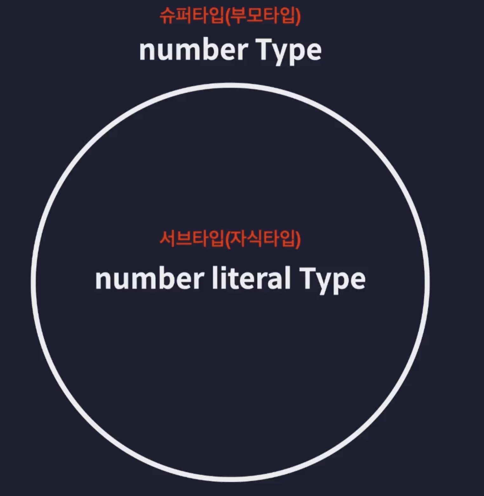
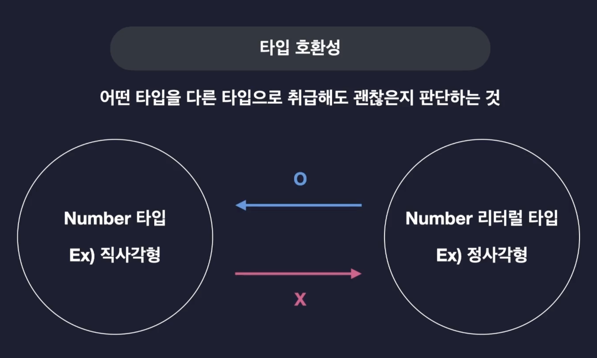
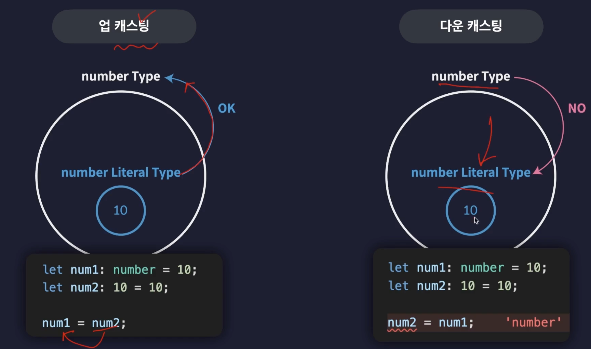
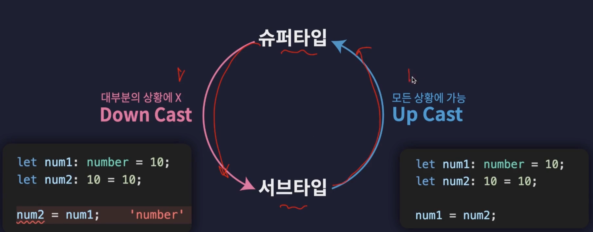

# 섹션 3. 타입스크립트를 이해한다는 것

## 19. 타입스크립트 이해하기

### 원리까지 배워야 하는 이유는!?

원리와 개념 이해에 대한 뒷받침이 없이는 제대로 사용할 수 없다. (문제 해결 불가능)

막바지에는 위의 이미지와 같은 복잡한 문법을 사용해야하기 때문에 학습이 필요하다.

## 20. 타입은 집합이다

- 이번 학습을 통해 각 타입이 왜 그렇게 동작하는지를 이해할 수 있게 될 것.

타입스크립트가 말하는 타입은 결국 집합을 의미한다.  
집합이라는 것은 동일한 속성과 특징들을 갖는 여러개의 원소들을 묶어둔 단위를 말하기도 한다.

일반적인 number 타입에는 위와 같은 형태가 속할 수 있지만 리터럴 타입의 경우 다른 형태를 띄고있다.

리터럴 20으로 타입을 지정하면 20 이외의 값은 가질 수 없게 된다.

정리하자면 number literal 타입은 number 타입의 부분집합에 속하며, 이를 위와 같이 슈퍼, 서브 타입으로 분류할 수 있다.

### 타입 호환성

아래와 같이 큰타입에 작은 타입의 값을 넣는 것은 상관이 없지만 더 작은 타입에 큰 타입의 값을 넣는 것에는 오류가 발생한다.

## 21. 타입 계층도와 함께 기본타입 살펴보기

업캐스트는 대부분의 상황에 허용되고, 다운캐스트는 많은 상황에서 허용되지 않는다.

실습 : src/chapter3.ts
